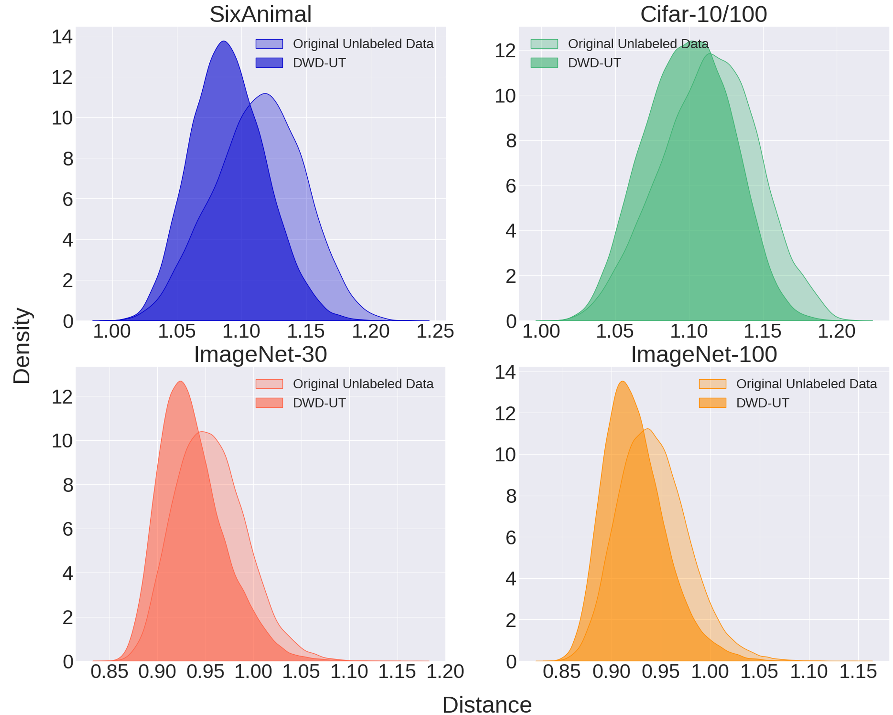

# DWD
This is the official implementation code for [DWD: Data Augmentation with Diffusion for Open-Set Semi-Supervised Learning](https://openreview.net/pdf?id=OP3sNTIE1O) (NeurIPS 2024')

----

To reproduce the result, please following the procedure.

#### Environment configuration.
- download the assets from [here](https://zenodo.org/records/11246593) and place the files in proper location.
- 'Cifar100.zip, cifar10.zip' locate in '/data' and extract them
- 'Autoencoder_KL_Cifars_16x16x3_Attn.pt' place in '/assets/autoencoder'
- 'train_1000labels.npz' place in 'assets/fid_stats'

#### Train DWD
- python train_ldm_DWD_SDE.py --interval --cfg True --rep_with_img True --cond joint --exp_name Reproducing

#### Transform the data based on unlabeled data
- python sample_ldm_SDE.py --pseudo True --cond multi

#### Train DWD-SL using transformed data
- python downstream_cifars.py --init Random --lr 0.03 --lr-decay True --wd 1e-4 --bs 64 --nest True --optim AdamW --arch wideresnet --epochs 256 --steps 1024 --rand_aug True --label-smoothing 0.15 --seed 74 --exp_name AdamW_003lr_Seed74

#### Train FixMatch + DWD-UT using tranformed data
- python train.py --dataset cifar10 --num-labeled 100 --arch wideresnet --batch-size 64 --lr 0.03 --expand-labels --seed 5 --u_data ood --img_size 32 --exp_name Reproducing

 

----

## Quantitative Result

**[ DWD-SL ]** Uses transformed data with given class conditions __( Supervised )__  
**[ DWD-UT ]** Utilizes only transformed unlabeled data __( Semi-supervised )__

 

- Performance comparison on four tasks. We report the mean accuracy averaged over three seeds, along with standard error. Top scores for each task are highlighted
  
| Task Name        | MixMatch    | FixMatch    | MPL         | OpenMatch   | Fix-A-Step  | IOMatch     | DWD-SL      |
|------------------|-------------|-------------|-------------|-------------|-------------|-------------|-------------|
| SixAnimal (ζ = 75%) | 80.77±0.11 | 82.50±0.16 | 65.62±0.47 | 80.34±0.21 | 85.34±0.17 | 83.05±0.16 | **85.86±0.28** |
| CIFAR-10/100     | 71.02±0.32  | 78.91±0.15  | 70.95±0.34  | 70.15±0.30  | 74.60±0.31  | 77.66±0.22  | **80.05±0.14** |
| ImageNet-30      | 68.67±0.37  | 70.07±0.26  | 72.65±0.70  | 72.78±0.48  | 79.67±0.81  | 79.23±0.29  | **82.20±0.38** |
| ImageNet-100     | 69.30±0.41  | 65.11±0.32  | 68.43±0.33  | 65.42±0.36  | 65.80±0.49  | 66.85±0.19  | **82.81±0.31** |

 

- Performance of standard SSL methods before and after applying DWD-UT.
  
| Task Name        | MixMatch    | MixMatch  + DWD-UT | FixMatch    | FixMatch  + DWD-UT | MPL         | MPL  + DWD-UT |
|------------------|-------------|-------------------|-------------|-------------------|-------------|--------------|
| SixAnimal (ζ = 75%) | 80.77±0.11 | **84.72±0.22**   | 82.50±0.16  | **87.17±0.19**   | 65.62±0.47  | **83.88±0.18** |
| CIFAR-10/100     | 71.02±0.32  | **80.47±0.49**   | 78.91±0.15  | **83.80±0.25**   | 70.95±0.34  | **80.24±0.56** |
| ImageNet-30      | 68.67±0.37  | **85.20±0.10**   | 70.07±0.26  | **81.87±0.61**   | 72.65±0.70  | **90.20±0.23** |
| ImageNet-100     | 69.30±0.41  | **81.62±0.36**   | 65.11±0.32  | **80.38±0.34**   | 68.43±0.33  | **75.66±0.26** |

 

- Performance of open-set SSL methods before and after applying DWD-UT.
  
| Task Name        | OpenMatch   | OpenMatch  + DWD-UT | Fix-A-Step  | Fix-A-Step  + DWD-UT | IOMatch     | IOMatch  + DWD-UT |
|------------------|-------------|--------------------|-------------|---------------------|-------------|------------------|
| SixAnimal (ζ = 75%) | 80.34±0.21 | **85.71±0.33**    | 85.34±0.17  | **86.68±0.23**     | 83.05±0.16  | **87.20±0.13**   |
| CIFAR-10/100     | 70.15±0.30  | **80.99±0.03**    | 74.60±0.31  | **79.02±0.75**     | 77.66±0.22  | **83.22±0.16**   |
| ImageNet-30      | 72.78±0.48  | **75.28±0.68**    | 79.67±0.81  | **82.95±0.45**     | 79.23±0.29  | **81.96±0.26**   |
| ImageNet-100     | 65.42±0.36  | **80.02±0.45**    | 65.80±0.49  | **76.23±0.37**     | 66.85±0.19  | **80.19±0.13**   |

 

## Qualitative Result
- Data transform example by DWD

- Comparison of feature distance between origin and transformed images

----

Our code implementation is based on the following public repositories:
1. Latent Diffusion: [https://github.com/CompVis/latent-diffusion](https://github.com/CompVis/latent-diffusion)
2. DPT: [https://github.com/ML-GSAI/DPT](https://github.com/ML-GSAI/DPT)
3. nnPU: [https://github.com/kiryor/nnPUlearning](https://github.com/cimeister/pu-learning)
4. DPM-Solver: [https://github.com/LuChengTHU/dpm-solver](https://github.com/LuChengTHU/dpm-solver)
5. CFG: [https://github.com/coderpiaobozhe/classifier-free-diffusion-guidance-Pytorch/tree/master](https://github.com/coderpiaobozhe/classifier-free-diffusion-guidance-Pytorch/tree/master)

